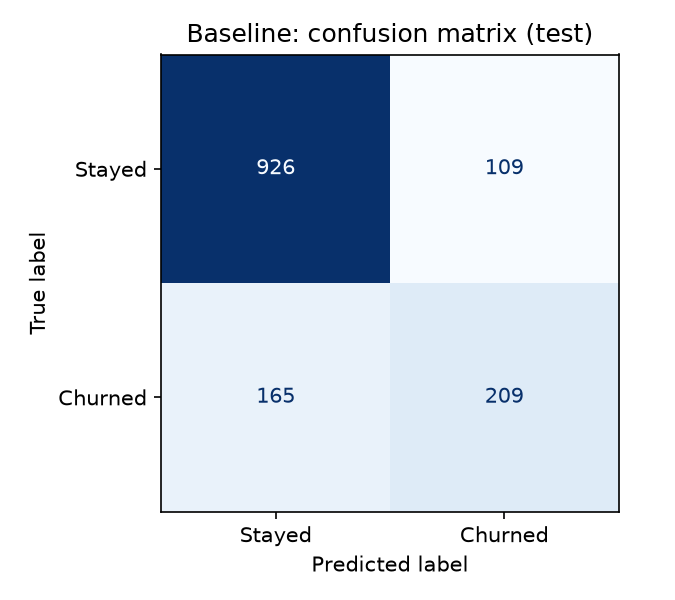
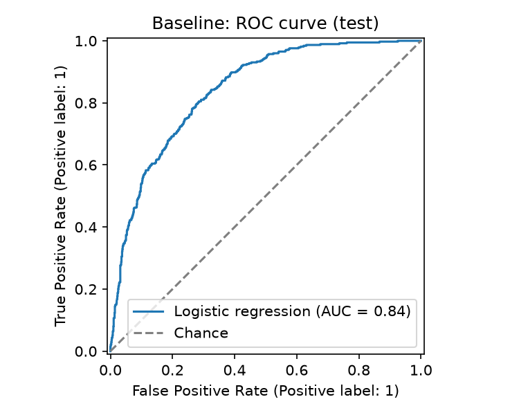

# Customer Churn Prediction — Milestone 01: Data Preparation & Baseline Model

A supervised machine-learning project that predicts whether a telecom customer will churn.
This milestone covers exploratory data analysis, data cleaning, a leakage-safe preprocessing pipeline, and a first baseline model evaluated on a held-out test set.

**Headline result:** a plain logistic-regression baseline reaches **ROC-AUC 0.842** and **F1 0.604** on the held-out test set, compared with ROC-AUC 0.500 and F1 0.000 for a majority-class predictor. It identifies about 56% of churners with about 66% precision at the default 0.5 threshold. Hyperparameter tuning and more complex models are intentionally left for later milestones.

## Table of Contents
1. [Problem Definition](#1-problem-definition)
2. [Dataset](#2-dataset)
3. [Repository Structure](#3-repository-structure)
4. [Getting Started](#4-getting-started)
5. [Methodology](#5-methodology)
6. [Results](#6-results)
7. [Limitations & Risks](#7-limitations--risks)
8. [Next Steps](#8-next-steps)
9. [Reproducibility](#9-reproducibility)
10. [Author & Acknowledgements](#10-author--acknowledgements)

---

## 1. Problem Definition
| Item | Definition |
| --- | --- |
| Task type | **Binary classification** |
| Target | `Churn` (`Yes`/`No` in the raw file, encoded as 1/0; churn is the positive class) |
| Business context | A telecom provider wants to find customers likely to leave, so retention offers can be targeted. Keeping a customer is usually cheaper than acquiring a new one |
| ML objective | Estimate the probability that a customer churns from their account, service and demographic attributes |

## 2. Dataset
* **Name:** Telco Customer Churn (IBM sample dataset)
* **Source:** [Kaggle — blastchar/telco-customer-churn](https://www.kaggle.com/datasets/blastchar/telco-customer-churn) (file `WA_Fn-UseC_-Telco-Customer-Churn.csv`). A free Kaggle account is needed to download it. See the dataset page for its license and terms.
* The raw data is **not committed** to this repository (see `.gitignore`).

### Dataset facts
| Fact | Value |
| --- | --- |
| Rows | 7,043 |
| Columns | 21 (19 features + `customerID` + `Churn`) |
| Churners | 1,869 (26.5% of customers) |
| Blank `TotalCharges` values | 11 (all belonged to customers with `tenure == 0`) |
| Duplicate rows | 0 |
| Negative numeric values | 0 |
| Invalid target values | 0 |
| Train / test rows | 5,634 / 1,409 (churn rate 26.5% in both) |

### Feature dictionary
| Group | Columns | Type |
| --- | --- | --- |
| Identifier | `customerID` | Excluded from modelling |
| Demographics | `gender`, `SeniorCitizen`, `Partner`, `Dependents` | Categorical / binary |
| Account | `tenure` (months), `Contract`, `PaperlessBilling`, `PaymentMethod` | Numeric + categorical |
| Charges | `MonthlyCharges`, `TotalCharges` | Numeric |
| Services | `PhoneService`, `MultipleLines`, `InternetService`, `OnlineSecurity`, `OnlineBackup`, `DeviceProtection`, `TechSupport`, `StreamingTV`, `StreamingMovies` | Categorical |
| Target | `Churn` | Binary |

## 3. Repository Structure
```text
Customer-Churn-Prediction/
├── data/
│   ├── raw/                    # place the downloaded CSV here (git-ignored)
│   └── processed/              # cleaned data written by the notebook/script (git-ignored)
├── notebooks/
│   └── milestone_01_data_prep_baseline.ipynb   # EDA, cleaning, split, pipeline, baseline, evaluation
├── src/
│   ├── config.py               # paths, random seed, column names
│   ├── data_preparation.py     # loading, rule-based cleaning, X/y creation
│   ├── preprocessing.py        # ColumnTransformer + baseline model pipelines
│   ├── evaluation.py           # metrics, cross-validation, plots
│   └── train_baseline.py       # end-to-end reproducible run
├── reports/
│   ├── figures/                # confusion matrix and ROC curve
│   └── baseline_metrics.json   # metrics from the reference run
├── README.md
├── requirements.txt
└── .gitignore
```

## 4. Getting Started

### Environment
* Python: **[FILL: version you ran, e.g. 3.12 — run `python --version`]**
* Libraries: pandas, numpy, matplotlib, seaborn, scikit-learn, JupyterLab (see `requirements.txt`)

### Setup
```bash
git clone https://github.com/naikmayanka04/Customer-Churn-Prediction.git
cd Customer-Churn-Prediction
python -m venv .venv
source .venv/bin/activate        # Windows: .venv\Scripts\activate
pip install -r requirements.txt
```

### Get the data
Download the CSV from the Kaggle link above and save it as `data/raw/WA_Fn-UseC_-Telco-Customer-Churn.csv` (exact filename).

### Run
* **Full analysis:** open `notebooks/milestone_01_data_prep_baseline.ipynb` in Jupyter or VS Code and run all cells from top to bottom.
* **Baseline only:** from the repository root run
  ```bash
  python -m src.train_baseline
  ```
  This cleans the data, splits it, cross-validates on the training set, evaluates on the test set once, and writes `reports/baseline_metrics.json` and the figures in `reports/figures/`.

### Troubleshooting
| Problem | Fix |
| --- | --- |
| `ImportError: attempted relative import with no known parent package` | Run the script as a module from the repository root: `python -m src.train_baseline` (not `python src/train_baseline.py`) |
| `FileNotFoundError: Dataset not found` | The CSV is missing or misnamed; check `data/raw/` |
| Notebook cannot import `src` | Open it from the repository (the first cell finds the project root automatically) |

## 5. Methodology

### 5.1 Key EDA findings
Confirmed by the reference run:
* The target is imbalanced: 26.5% of customers churned, so accuracy alone is misleading.
* `TotalCharges` loads as text because 11 entries are blank; all 11 belong to customers with `tenure == 0` (new customers not yet billed).
* No duplicate rows, negative values, or invalid target values were found.

Add your own observations from the notebook (Section 4), for example the relationship between tenure, contract type and churn:
* **[FILL: finding 1 with evidence, e.g. churn rate by contract type]**
* **[FILL: finding 2 with evidence, e.g. churn rate by tenure band]**
* **[FILL: finding 3, or any surprising result]**

### 5.2 Cleaning decisions
All cleaning is rule-based (nothing is learned from the data), so it is safe before the split.

| Issue | Decision | Reasoning / trade-off |
| --- | --- | --- |
| Whitespace and blank strings | Strip text; blanks become missing | Blank strings hide missing values from `isna()` |
| `TotalCharges` stored as text | Convert to numeric | It is a monetary amount; non-numeric entries would become NaN and are counted in the cleaning log |
| `TotalCharges` blank where `tenure == 0` | Set to 0 (11 rows) | A customer with no tenure has not been billed. The assumption was verified: all 11 blanks had `tenure == 0`, so no rows were dropped |
| `SeniorCitizen` coded 0/1 | Recode to No/Yes | Consistent with the other binary features |
| Duplicates / invalid target | Checked; none found | Rules remain in the code |
| Outliers | Not removed | Charges are bounded and plausible; scaling handles the range |

### 5.3 Features, target and leakage
* `y` = 1 if `Churn == "Yes"`, else 0. `X` = all columns except `Churn` and `customerID`.
* All features are account, service or demographic attributes documented as known before the churn outcome.
* Expanded versions of this dataset contain columns such as `Churn Label`, `Churn Score` and `Churn Reason` that leak the target. They are not in the standard file, and the code drops them if present.

### 5.4 Train/test split
80/20 split, **stratified** on the target, `random_state=42`, performed before any preprocessing is fitted. The test set is used once, for the final evaluation. Model comparison used cross-validation on the training set only.

### 5.5 Preprocessing
A scikit-learn `ColumnTransformer` inside a `Pipeline`:

| Feature group | Steps |
| --- | --- |
| Numeric | median imputation → standard scaling |
| Categorical | most-frequent imputation → one-hot encoding (`handle_unknown="ignore"`) |

Because everything is fitted inside the pipeline on training data only (and re-fitted per fold in cross-validation), no test or validation information leaks into preprocessing.

### 5.6 Models
* **Dummy classifier (class prior):** predicts the majority class; the floor any real model must beat.
* **Logistic regression (baseline):** default regularisation, no class weights, no tuning. Chosen because it is simple, fast, interpretable and provides probabilities for ROC-AUC.

### 5.7 Metrics
| Metric | Meaning in this project |
| --- | --- |
| Accuracy | Share of customers classified correctly (misleading under imbalance) |
| Precision | Of customers flagged as churners, the share who really churn (low = wasted retention offers) |
| Recall | Of real churners, the share caught (low = churners missed) |
| F1 | Harmonic mean of precision and recall at the 0.5 threshold |
| ROC-AUC | Threshold-independent ranking quality (0.5 = chance) |
| PR-AUC | Precision-recall area; more informative for the minority class |

## 6. Results
Full-precision values are in `reports/baseline_metrics.json`.

### 6.1 Cross-validation (5-fold stratified, training set only)
| Metric | Dummy (mean) | Logistic Regression (mean ± std) |
| --- | ---: | ---: |
| Accuracy | 0.735 | 0.802 ± 0.012 |
| Precision | 0.000 | 0.652 ± 0.026 |
| Recall | 0.000 | 0.544 ± 0.041 |
| F1 | 0.000 | 0.592 ± 0.030 |
| ROC-AUC | 0.500 | 0.846 ± 0.013 |

### 6.2 Held-out test set (evaluated once)
| Metric | Dummy (majority) | Logistic Regression |
| --- | ---: | ---: |
| Accuracy | 0.735 | 0.806 |
| Precision | 0.000 | 0.657 |
| Recall | 0.000 | 0.559 |
| F1-score | 0.000 | 0.604 |
| ROC-AUC | 0.500 | 0.842 |
| PR-AUC | 0.265 | 0.634 |

Confusion matrix for logistic regression (test set, 1,409 customers):

| | Predicted: stays | Predicted: churns |
| --- | ---: | ---: |
| **Actual: stays** | 926 (TN) | 109 (FP) |
| **Actual: churns** | 165 (FN) | 209 (TP) |




### 6.3 Interpretation
* **The baseline learns real signal.** The dummy model's accuracy (0.735) equals the share of non-churners, and it never finds a churner. Logistic regression lifts accuracy to 0.806, but the more telling gains are ROC-AUC (0.500 → 0.842) and PR-AUC (0.265 → 0.634; 0.265 is the churn rate, the value expected from chance).
* **Results are stable.** Test scores sit within one standard deviation of the cross-validation means on every metric (for example ROC-AUC 0.842 vs 0.846 ± 0.013; F1 0.604 vs 0.592 ± 0.030), so there is no sign that the test split was unusually lucky or unlucky.
* **The model misses more churners than it falsely flags.** It catches 209 of 374 churners (recall 0.559) and wrongly flags 109 of 1,035 loyal customers. Whether that is acceptable depends on the relative cost of a lost customer versus an unnecessary retention offer, which this project does not have.
* **Possible underfitting is not ruled out.** Training-set scores were not recorded, so a train-versus-validation gap was not measured. A linear model may be too simple to capture interactions (for example between contract, tenure and services), which later milestones can test.
* **[FILL: 1–2 sentences on which features the coefficients highlight, from notebook Section 11, and whether they make business sense]**

## 7. Limitations & Risks
* **Data:** a public IBM sample dataset; it may not reflect real telecom churn behaviour.
* **No time dimension:** the data is a snapshot, so a time-based split and drift checks are not possible.
* **Leakage:** none found in the standard 21-column file, but that judgement rests on the column documentation and a training-set screen, not on a guarantee.
* **Class imbalance:** 26.5% churn limits how high precision and recall can both be at a fixed threshold.
* **Evaluation:** a single 80/20 split gives one point estimate. With 374 churners in the test set, recall carries roughly ±5 percentage points of sampling uncertainty (binomial approximation).
* **Modelling:** one untuned linear model, default 0.5 threshold, no class weighting, no interaction terms.

## 8. Next Steps
Ideas for later milestones (not done here): class weighting or resampling; choosing the decision threshold from retention-offer costs; regularisation tuning; tree-based models (random forest, gradient boosting); feature engineering (e.g. number of add-on services, tenure bands); probability calibration; repeated cross-validation with confidence intervals.

## 9. Reproducibility
* Fixed seed (`random_state=42`), stratified 80/20 split, 5-fold stratified CV.
* Preprocessing fitted on training data only.
* `python -m src.train_baseline` regenerates `reports/baseline_metrics.json` and the figures from the raw CSV.
* Exact package versions used: **[FILL: optional — `pip freeze > requirements-lock.txt` and commit it]**

## 10. Author & Acknowledgements
* **Author:** Mayanka Naik
* **Context:** MINT Technologies — Machine Learning project, Milestone 01
* **Dataset:** Telco Customer Churn (IBM sample data), obtained via Kaggle.
* **License:** for internship evaluation only